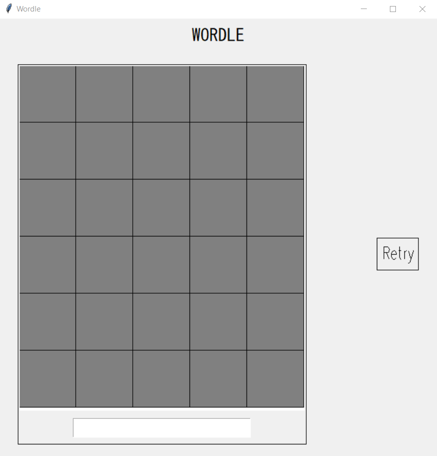
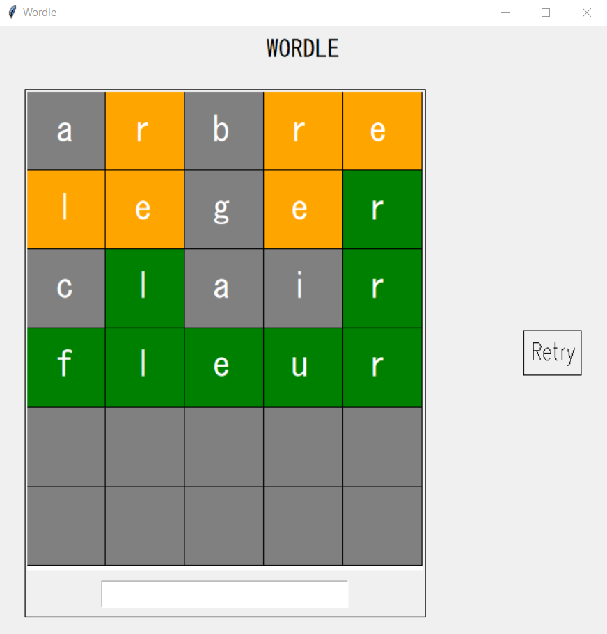

# Wordle

## Description
Hello and welcome to this Wordle game, some months ago, I made a french version from scratch of the New York Times Wordle game that I quite played and enjoyed. There's a link down below to the website
The rules are the same as the original, you have 6 tries to find a 5-letter word, just guess in the entry bar, when a letter doesn't change color (still blue), it means the letter is not in the word, otherwise it will be in yellow (letter present in the word but not at the right place) or green (the right letter at the right place).

I made this small game right after my big project called "Todochii", still with the Tkinter library, in a few hours.

If you want to add new words or completely change the language, you'll have to manually edit the "words.txt" and add/replace words. Also be sure to have the wordle.py in the same directory as the words.txt to make it work.

Website of the New York Times Wordle original game: https://www.nytimes.com/games/wordle/index.html

## Author
Realized by Henrique D.

## Demo images
### Start of a game

### End of the game

